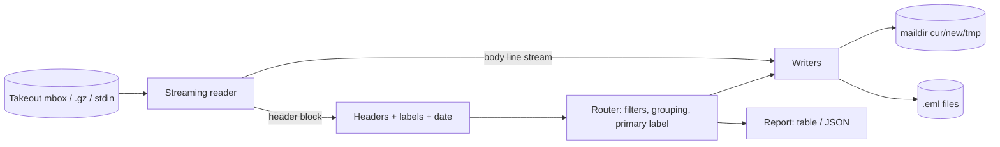

# mailslice

[English](README.md) | [中文](README.zh.md) | [日本語](README.ja.md)

[](LICENSE) [](CHANGELOG.md) [](pyproject.toml)  [](CONTRIBUTING.md)

**巨大な Google Takeout mbox のためのオープンソース・ストリーム分割ツール — 40 GB の Gmail を一定メモリでラベルと年ごとに maildir または EML へスライス。**


```bash
git clone https://github.com/JaydenCJ/mailslice && cd mailslice && pip install -e .
```

> **プレリリース：** mailslice はまだ PyPI に公開されていません。初回リリースまでは [JaydenCJ/mailslice](https://github.com/JaydenCJ/mailslice) をクローンし、リポジトリのルートで `pip install -e .` を実行してください。ランタイム依存はゼロ — 標準ライブラリだけで動きます。

## なぜ mailslice？

Google Takeout は Gmail の全履歴を、何をもってしても開けない 1 個の mbox ファイルとして渡してきます：メールクライアントはインポートで固まり、Python の `mailbox` モジュールはファイル全体のインメモリ索引を作り、mb2md 時代の古典スクリプトは Takeout の規模にも `X-Gmail-Labels` ヘッダにも先立つ存在 — 走り切ったとしても、20 年かけて丁寧にラベル付けしたメールは区別のない山に積まれ、段落が "From " で始まる箇所では本文が寸断されます。mailslice はファイルを固定サイズのチャンクで一度だけ流し、`startswith("From ")` ではなく本物のセパレータ・ヒューリスティックで境界を検出し、各メッセージを Gmail ラベルと年でルーティングして、標準の maildir（Unread/Starred からフラグを復元）またはプレーンな `.eml` を書き出します。メモリ使用量は 1 通のヘッダ上限にのみ拘束され — ファイルや添付のサイズには依存せず — データがマシンの外へ出ることは一切ありません。

|  | mailslice | mb2md | Python `mailbox` | Thunderbird インポート |
|---|---|---|---|---|
| 40 GB mbox での一定メモリ | はい | 行バッファだが単一出力のみ | いいえ（全メッセージのインメモリ目次） | いいえ（UI フリーズ、不完全な取り込み） |
| Gmail ラベル → フォルダのルーティング | はい、入れ子・非 ASCII ラベル対応 | いいえ | いいえ | いいえ（ラベル消失） |
| 年ごとの分割 | はい（`label/year`、`label`、`year`） | いいえ | 手書きコードが必要 | いいえ |
| 本文を壊さない境界検出 | エンベロープ + asctime ヒューリスティック | どの `From ` でも分割 | どの `From ` でも分割 | 該当なし |
| Unread/Starred → maildir フラグ | はい | いいえ | いいえ | 部分的 |
| ランタイム依存 | 0 | Perl | 標準ライブラリ | フルのメールクライアント |

<sub>比較対象は mb2md 3.20（2004）、CPython 3.12 の `mailbox` モジュール（`mailbox.mbox` は目次を先行構築）、および ImportExportTools NG 入りの Thunderbird 128、2026-07 時点。mailslice の依存数は [pyproject.toml](pyproject.toml) の `dependencies = []` の通りです。</sub>

## 特徴

- **一定メモリのストリーミング** — 固定サイズのチャンク読み込み、バッファは上限付きヘッダブロック 1 個だけ、本文は出力ファイルへ直結；2 GB の添付もメモリに載ることなく流れ切ります。
- **メールを寸断しない境界検出** — 空行の後に本物のセパレータ（エンベロープ + asctime 日付）らしき行が来たときだけ分割；Takeout がエスケープし損ねた本文の `From ` 行はあるべき場所に残ります。
- **Gmail ラベル対応** — 引用符付きカンマ、RFC 2047 エンコードの日本語ラベル、入れ子の `Work/Projects/Q1` 階層；状態ラベル（Unread、Starred、Trash、Drafts）はフォルダではなく maildir フラグになります。
- **ファイルシステムに安全な出力** — ラベルパスはセグメント単位でサニタイズ（NTFS の末尾ドット罠、`CON`/`NUL` デバイス名、制御バイト、80 文字上限）、maildir 配送は仕様通りの tmp→cur リネームで、名前は決定的かつ再現可能です。
- **正直な帳簿** — 実行の最後は必ずラベル別・年別の表（または `--json`）：通数、バイト数、不正形式の数、理由別のスキップ数；日付不明のメールは消えるのではなく可視の `no-date` バケットへ入ります。
- **オフライン・依存ゼロ・テレメトリなし** — 純粋な標準ライブラリでネットワークコードは皆無；メールはディスクから一度読まれ、ディスクへ一度書かれるだけです。

## クイックスタート

インストールしたら、同梱の Takeout 形サンプルを生成します（実際のエクスポートを指定しても構いません）：

```bash
git clone https://github.com/JaydenCJ/mailslice && cd mailslice && pip install -e .
python examples/make_sample_mbox.py takeout.mbox
mailslice scan takeout.mbox
```

実際にキャプチャした `scan` の出力（一部の行は `...` で省略）：

```text
messages: 8   size: 1.9 KiB   span: 2020-2021
label/year             messages  size
Inbox/2020                    2  562 B
...
Receipts, 2020/2020           1  236 B
...
Work/Projects/Q1/2021         1  246 B
請求書/2020                      1  261 B
total: 8 messages, 1.9 KiB, 0 malformed, 0 skipped
```

続いて maildir へ分割し、スパムは置き去りにします：

```bash
mailslice split takeout.mbox -o mail --exclude-label Spam
find mail -type f | sort | head -3
```

```text
label/year             messages  size
Inbox/2021                    1  180 B
Receipts, 2020/2020           1  237 B
...
total: 8 messages, 1.9 KiB, 0 malformed, 1 skipped
wrote maildir folders under mail/
mail/Inbox/2021/cur/1623834000.M000001.mailslice:2,
mail/Receipts, 2020/2020/cur/1583049600.M000001.mailslice:2,S
mail/Sent/2021/cur/1610702100.M000001.mailslice:2,S
```

`:2,S` サフィックスは Gmail の状態ラベルから復元された本物の maildir フラグです — 未読メールに `S` は付かず、スター付きは `F` を持ちます。1 通 1 ファイルが好みなら `--format eml` で `20200102-090000-Kickoff-notes.eml` 形式に書き出せます。再圧縮したエクスポートもそのまま読めます：`.gz` 入力はその場で伸長され、`-` は stdin から読みます。

## コマンドリファレンス

| オプション | デフォルト | 効果 |
|---|---|---|
| `--format {maildir,eml}` | `maildir` | 出力形式；内容は両形式でバイト単位に同一 |
| `--group-by {label/year,label,year,none}` | `label/year` | 出力ルート以下のディレクトリ構成 |
| `--include-label L` / `--exclude-label L` | — | ラベルでフィルタ、階層対応：`Work` は `Work/Q3` に一致 |
| `--since Y` / `--until Y` | — | 両端を含む年ウィンドウ（日付不明メールはスキップ） |
| `--all-labels` | オフ | 主ラベルだけでなく全ラベルのディレクトリへ複製 |
| `--escaping {mboxrd,mboxo,none}` | `mboxrd` | 本文 `From ` 行のエスケープ方式 |
| `--dry-run` | オフ | ルーティングと報告のみ、ファイルは一切書かない |
| `--json` / `--progress` / `--limit N` | — | 機械可読出力；stderr ハートビート；scan プレビュー上限 |

## ラベルはどうフォルダに写るか

各メッセージは**主ラベル**へ入ります：最初のユーザーラベル、なければ最初のシステムフォルダラベル（Inbox、Sent、Archived など）、それもなければ `Unlabeled`。状態ラベルは決してフォルダにならず、フラグになります：

| Gmail 状態ラベル | maildir フラグ |
|---|---|
| *（Unread でない）* | `S`（既読） |
| Starred | `F`（フラグ付き） |
| Trash / Bin | `T`（削除済み） |
| Drafts | `D`（下書き） |

完全なルールブック — 境界ヒューリスティック、サニタイズ、ファイル名方式、日付復元の順序 — は [`docs/splitting-rules.md`](docs/splitting-rules.md) にあります。

## 検証

このリポジトリは CI を一切同梱しません；上記の主張はすべてローカル実行で検証されています。このリポジトリのチェックアウトから再現できます：

```bash
pip install -e '.[dev]' && pytest && bash scripts/smoke.sh
```

出力（実際の実行からコピー、`...` で省略）：

```text
93 passed in 0.68s
...
[split] wrote maildir folders under /tmp/mailslice-smoke.nFT890/mail/
SMOKE OK
```

## アーキテクチャ



## ロードマップ

- [x] ストリーミングリーダー、ラベル対応ルーター、maildir/EML ライター、scan/split CLI、フィルタ、レポート（v0.1.0）
- [ ] PyPI 公開、`pip install mailslice` 対応
- [ ] 展開せずに Takeout の `.zip`/`.tgz` から直接 mbox を読む
- [ ] 数時間かかる分割の中断・再開（チェックポイント）
- [ ] 重複エクスポートを Message-ID キーで束ねる任意の重複排除パス

全リストは [open issues](https://github.com/JaydenCJ/mailslice/issues) を参照してください。

## コントリビュート

コントリビュート歓迎です — [good first issue](https://github.com/JaydenCJ/mailslice/issues?q=is%3Aissue+is%3Aopen+label%3A%22good+first+issue%22) から始めるか、[discussion](https://github.com/JaydenCJ/mailslice/discussions) を開いてください。開発環境の構築は [CONTRIBUTING.md](CONTRIBUTING.md) を参照。

## ライセンス

[MIT](LICENSE)
