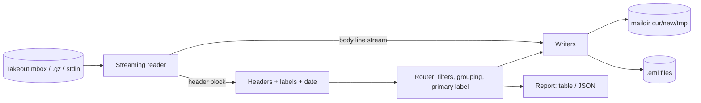

# mailslice

[English](README.md) | [中文](README.zh.md) | [日本語](README.ja.md)

[](LICENSE) [](CHANGELOG.md) [](pyproject.toml)  [](CONTRIBUTING.md)

**Open-source stream-splitter for giant Google Takeout mbox files — slice 40 GB of Gmail into maildir or EML by label and year, in constant memory.**


```bash
git clone https://github.com/JaydenCJ/mailslice && cd mailslice && pip install -e .
```

> **Pre-release:** mailslice is not yet published to PyPI. Until the first release, clone [JaydenCJ/mailslice](https://github.com/JaydenCJ/mailslice) and run `pip install -e .` from the repository root. Zero runtime dependencies — the standard library is all it needs.

## Why mailslice?

Google Takeout hands you your entire Gmail history as one mbox file that nothing opens: mail clients freeze on import, Python's `mailbox` module builds an in-memory table of the whole file, and the classic mb2md-era scripts predate both Takeout's scale and its `X-Gmail-Labels` header — so even when they finish, twenty years of carefully labeled mail lands in one undifferentiated heap, with bodies shredded wherever a paragraph happened to start with "From ". mailslice streams the file once in fixed-size chunks, detects boundaries with a real separator heuristic instead of `startswith("From ")`, routes each message by its Gmail labels and year, and writes standard maildir (with flags recovered from Unread/Starred) or plain `.eml` files. Memory use is bounded by one message's headers — never by file or attachment size — and nothing ever leaves your machine.

|  | mailslice | mb2md | Python `mailbox` | Thunderbird import |
|---|---|---|---|---|
| Constant memory on a 40 GB mbox | Yes | Line-buffered but single-output | No (in-memory ToC of every message) | No (UI freezes, partial imports) |
| Gmail label → folder routing | Yes, incl. nested + non-ASCII labels | No | No | No (labels are lost) |
| Split by year | Yes (`label/year`, `label`, `year`) | No | Manual code | No |
| Body-safe boundary detection | Envelope + asctime heuristic | Splits on any `From ` | Splits on any `From ` | N/A |
| Unread/Starred → maildir flags | Yes | No | No | Partial |
| Runtime dependencies | 0 | Perl | stdlib | full mail client |

<sub>Comparisons refer to mb2md 3.20 (2004), the CPython 3.12 `mailbox` module (`mailbox.mbox` builds its table of contents eagerly), and Thunderbird 128 with ImportExportTools NG, as of 2026-07. mailslice's count is `dependencies = []` in [pyproject.toml](pyproject.toml).</sub>

## Features

- **Constant-memory streaming** — fixed-size chunk reads, one capped header block buffered, bodies piped straight to output files; a 2 GB attachment flows through without ever being held in memory.
- **Boundaries that don't shred mail** — a line splits messages only when it looks like a real separator (envelope + asctime date) after a blank line; Takeout's unescaped body `From ` lines stay where they belong.
- **Gmail label awareness** — quoted commas, RFC 2047-encoded 日本語 labels, nested `Work/Projects/Q1` hierarchies; state labels (Unread, Starred, Trash, Drafts) become maildir flags instead of folders.
- **Filesystem-safe output** — label paths are sanitized per segment (NTFS trailing-dot traps, `CON`/`NUL` device names, control bytes, 80-char cap) and maildir deliveries do the spec's tmp→cur rename dance with deterministic, reproducible names.
- **Honest accounting** — every run ends with a per-label/per-year table (or `--json`): messages, bytes, malformed count, and skips broken down by reason; undatable mail lands in a visible `no-date` bucket instead of vanishing.
- **Offline, zero dependencies, no telemetry** — pure standard library, no network code at all; your mail is read once from disk and written once to disk.

## Quickstart

Install, then generate the bundled Takeout-shaped sample (or point at your real export):

```bash
git clone https://github.com/JaydenCJ/mailslice && cd mailslice && pip install -e .
python examples/make_sample_mbox.py takeout.mbox
mailslice scan takeout.mbox
```

Real captured `scan` output (rows elided with `...`):

```text
messages: 8   size: 1.9 KiB   span: 2020-2021
label/year             messages  size
Inbox/2020                    2  562 B
...
Receipts, 2020/2020           1  236 B
...
Work/Projects/Q1/2021         1  246 B
請求書/2020                      1  261 B
total: 8 messages, 1.9 KiB, 0 malformed, 0 skipped
```

Now split it into maildirs, leaving the spam behind:

```bash
mailslice split takeout.mbox -o mail --exclude-label Spam
find mail -type f | sort | head -3
```

```text
label/year             messages  size
Inbox/2021                    1  180 B
Receipts, 2020/2020           1  237 B
...
total: 8 messages, 1.9 KiB, 0 malformed, 1 skipped
wrote maildir folders under mail/
mail/Inbox/2021/cur/1623834000.M000001.mailslice:2,
mail/Receipts, 2020/2020/cur/1583049600.M000001.mailslice:2,S
mail/Sent/2021/cur/1610702100.M000001.mailslice:2,S
```

The `:2,S` suffix is a real maildir flag recovered from Gmail's state labels — unread mail gets no `S`, starred mail gets `F`. Prefer one file per message? `--format eml` writes `20200102-090000-Kickoff-notes.eml`-style files instead. Reading a re-compressed export works too: `.gz` inputs are decompressed on the fly, and `-` reads from stdin.

## Command reference

| Option | Default | Effect |
|---|---|---|
| `--format {maildir,eml}` | `maildir` | Output format; content is byte-identical in both |
| `--group-by {label/year,label,year,none}` | `label/year` | Directory scheme under the output root |
| `--include-label L` / `--exclude-label L` | — | Filter by label, hierarchical: `Work` matches `Work/Q3` |
| `--since Y` / `--until Y` | — | Inclusive year window (undated mail is skipped) |
| `--all-labels` | off | Copy into every label directory, not just the primary label |
| `--escaping {mboxrd,mboxo,none}` | `mboxrd` | How body `From ` lines were stuffed |
| `--dry-run` | off | Route and report without writing a single file |
| `--json` / `--progress` / `--limit N` | — | Machine output; stderr heartbeat; scan preview cap |

## How labels map to folders

Each message goes to its **primary label**: the first user label, else the first system folder label (Inbox, Sent, Archived, …), else `Unlabeled`. State labels never become folders — they become flags:

| Gmail state label | maildir flag |
|---|---|
| *(not Unread)* | `S` (seen) |
| Starred | `F` (flagged) |
| Trash / Bin | `T` (trashed) |
| Drafts | `D` (draft) |

The full rulebook — boundary heuristics, sanitization, filename schemes, date-recovery order — lives in [`docs/splitting-rules.md`](docs/splitting-rules.md).

## Verification

This repository ships no CI; every claim above is verified by local runs. Reproduce them from a checkout of this repository:

```bash
pip install -e '.[dev]' && pytest && bash scripts/smoke.sh
```

Output (copied from a real run, truncated with `...`):

```text
93 passed in 0.68s
...
[split] wrote maildir folders under /tmp/mailslice-smoke.nFT890/mail/
SMOKE OK
```

## Architecture



## Roadmap

- [x] Streaming reader, label-aware router, maildir/EML writers, scan/split CLI, filters, reports (v0.1.0)
- [ ] PyPI release with `pip install mailslice`
- [ ] Read the mbox directly out of Takeout's `.zip`/`.tgz` without extracting
- [ ] Checkpoint/resume for interrupted multi-hour splits
- [ ] Optional dedup pass keyed on Message-ID across overlapping exports

See the [open issues](https://github.com/JaydenCJ/mailslice/issues) for the full list.

## Contributing

Contributions are welcome — start with a [good first issue](https://github.com/JaydenCJ/mailslice/issues?q=is%3Aissue+is%3Aopen+label%3A%22good+first+issue%22) or open a [discussion](https://github.com/JaydenCJ/mailslice/discussions). See [CONTRIBUTING.md](CONTRIBUTING.md) for the development setup.

## License

[MIT](LICENSE)
