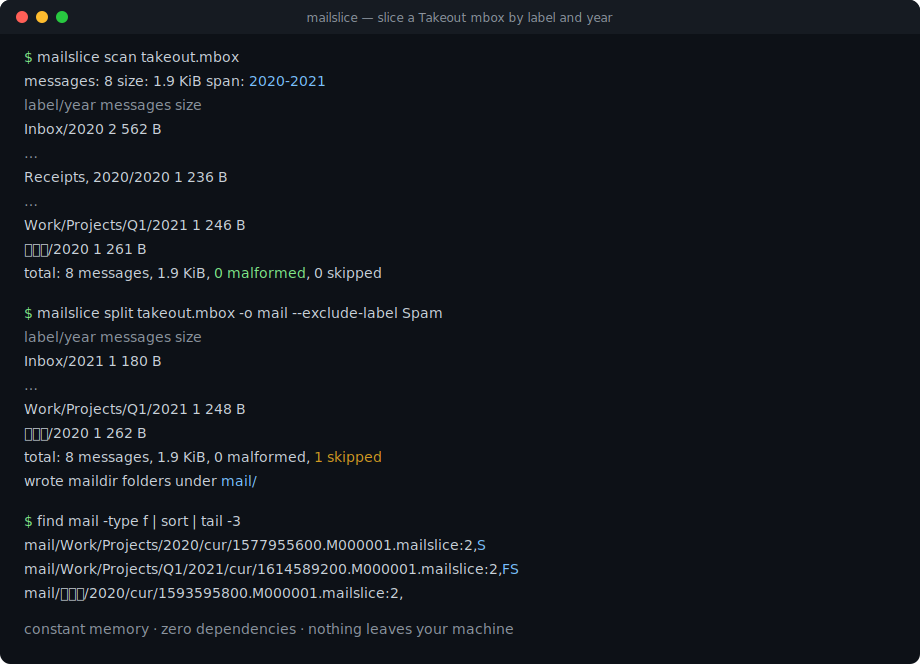
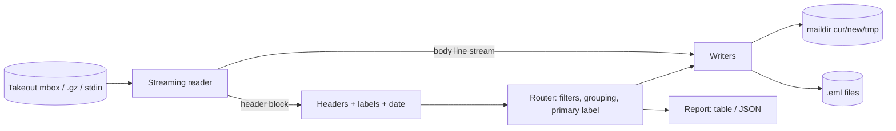

# mailslice

[English](README.md) | [中文](README.zh.md) | [日本語](README.ja.md)

[](LICENSE) [](CHANGELOG.md) [](pyproject.toml)  [](CONTRIBUTING.md)

**开源的超大 Google Takeout mbox 流式切分器——以恒定内存把 40 GB 的 Gmail 按标签和年份切成 maildir 或 EML。**



```bash
git clone https://github.com/JaydenCJ/mailslice && cd mailslice && pip install -e .
```

> **预发布版本：** mailslice 尚未发布到 PyPI。在首个正式版之前，请克隆 [JaydenCJ/mailslice](https://github.com/JaydenCJ/mailslice) 并在仓库根目录运行 `pip install -e .`。零运行时依赖——只需要标准库。

## 为什么选 mailslice？

Google Takeout 把你的全部 Gmail 历史打包成一个谁都打不开的 mbox 文件：邮件客户端导入时直接卡死，Python 的 `mailbox` 模块会为整个文件建立内存索引表，而 mb2md 时代的经典脚本既早于 Takeout 的规模、也早于它的 `X-Gmail-Labels` 头——即使跑完了，二十年精心打标签的邮件也会堆成一坨，凡是段落以 "From " 开头的地方正文还会被撕碎。mailslice 以固定大小的块只把文件流过一遍，用真正的分隔行启发式（而非 `startswith("From ")`）识别边界，按 Gmail 标签和年份路由每封邮件，然后写出标准 maildir（从 Unread/Starred 恢复旗标）或纯 `.eml` 文件。内存占用只受单封邮件头部的上限约束——与文件和附件大小无关——并且任何数据都不会离开你的机器。

|  | mailslice | mb2md | Python `mailbox` | Thunderbird 导入 |
|---|---|---|---|---|
| 40 GB mbox 下的恒定内存 | 是 | 按行缓冲但只有单一输出 | 否（为每封邮件建内存目录表） | 否（界面冻结、导入不完整） |
| Gmail 标签 → 文件夹路由 | 是，含嵌套与非 ASCII 标签 | 否 | 否 | 否（标签丢失） |
| 按年份切分 | 是（`label/year`、`label`、`year`） | 否 | 需手写代码 | 否 |
| 不撕碎正文的边界检测 | 信封 + asctime 启发式 | 见 `From ` 就切 | 见 `From ` 就切 | 不适用 |
| Unread/Starred → maildir 旗标 | 是 | 否 | 否 | 部分 |
| 运行时依赖 | 0 | Perl | 标准库 | 完整邮件客户端 |

<sub>对比对象为 mb2md 3.20（2004）、CPython 3.12 的 `mailbox` 模块（`mailbox.mbox` 会急切地构建目录表）以及装有 ImportExportTools NG 的 Thunderbird 128，截至 2026-07。mailslice 的依赖数即 [pyproject.toml](pyproject.toml) 中的 `dependencies = []`。</sub>

## 特性

- **恒定内存流式处理**——固定大小的块读取，仅缓冲一个有上限的头部块，正文直接管道到输出文件；2 GB 的附件全程流过，永远不会整体驻留内存。
- **不撕碎邮件的边界识别**——只有当一行在空行之后、且长得像真正的分隔行（信封 + asctime 日期）时才切分；Takeout 未转义的正文 `From ` 行会留在原处。
- **Gmail 标签感知**——带引号的逗号、RFC 2047 编码的日语标签、嵌套的 `Work/Projects/Q1` 层级；状态标签（Unread、Starred、Trash、Drafts）变成 maildir 旗标而不是文件夹。
- **文件系统安全的输出**——标签路径逐段消毒（NTFS 尾点陷阱、`CON`/`NUL` 设备名、控制字节、80 字符上限），maildir 投递遵循规范的 tmp→cur 重命名流程，文件名确定且可复现。
- **诚实的账目**——每次运行以按标签/按年份的表格（或 `--json`）收尾：邮件数、字节数、畸形计数、按原因细分的跳过数；无法定年的邮件进入可见的 `no-date` 桶而不是凭空消失。
- **离线、零依赖、无遥测**——纯标准库，完全没有网络代码；你的邮件从磁盘读一次、往磁盘写一次。

## 快速上手

安装后，生成内置的 Takeout 形状示例（或直接指向你的真实导出）：

```bash
git clone https://github.com/JaydenCJ/mailslice && cd mailslice && pip install -e .
python examples/make_sample_mbox.py takeout.mbox
mailslice scan takeout.mbox
```

真实捕获的 `scan` 输出（部分行以 `...` 省略）：

```text
messages: 8   size: 1.9 KiB   span: 2020-2021
label/year             messages  size
Inbox/2020                    2  562 B
...
Receipts, 2020/2020           1  236 B
...
Work/Projects/Q1/2021         1  246 B
請求書/2020                      1  261 B
total: 8 messages, 1.9 KiB, 0 malformed, 0 skipped
```

现在把它切分成 maildir，顺手扔掉垃圾邮件：

```bash
mailslice split takeout.mbox -o mail --exclude-label Spam
find mail -type f | sort | head -3
```

```text
label/year             messages  size
Inbox/2021                    1  180 B
Receipts, 2020/2020           1  237 B
...
total: 8 messages, 1.9 KiB, 0 malformed, 1 skipped
wrote maildir folders under mail/
mail/Inbox/2021/cur/1623834000.M000001.mailslice:2,
mail/Receipts, 2020/2020/cur/1583049600.M000001.mailslice:2,S
mail/Sent/2021/cur/1610702100.M000001.mailslice:2,S
```

`:2,S` 后缀是从 Gmail 状态标签恢复的真实 maildir 旗标——未读邮件没有 `S`，加星邮件带 `F`。想要一封邮件一个文件？`--format eml` 会改写成 `20200102-090000-Kickoff-notes.eml` 风格的文件。重新压缩过的导出也能直接读：`.gz` 输入即时解压，`-` 从 stdin 读取。

## 命令参考

| 选项 | 默认值 | 效果 |
|---|---|---|
| `--format {maildir,eml}` | `maildir` | 输出格式；两种格式的内容逐字节一致 |
| `--group-by {label/year,label,year,none}` | `label/year` | 输出根目录下的目录方案 |
| `--include-label L` / `--exclude-label L` | — | 按标签过滤，支持层级：`Work` 匹配 `Work/Q3` |
| `--since Y` / `--until Y` | — | 闭区间年份窗口（无日期邮件会被跳过） |
| `--all-labels` | 关 | 复制到每个标签目录，而不只是主标签 |
| `--escaping {mboxrd,mboxo,none}` | `mboxrd` | 正文 `From ` 行的转义方式 |
| `--dry-run` | 关 | 只路由和报告，不写任何文件 |
| `--json` / `--progress` / `--limit N` | — | 机器可读输出；stderr 心跳；scan 预览上限 |

## 标签如何映射到文件夹

每封邮件进入它的**主标签**：第一个用户标签，否则第一个系统文件夹标签（Inbox、Sent、Archived 等），否则 `Unlabeled`。状态标签永远不会变成文件夹——它们变成旗标：

| Gmail 状态标签 | maildir 旗标 |
|---|---|
| *（非 Unread）* | `S`（已读） |
| Starred | `F`（加星） |
| Trash / Bin | `T`（已删除） |
| Drafts | `D`（草稿） |

完整规则手册——边界启发式、消毒、文件名方案、日期恢复顺序——见 [`docs/splitting-rules.md`](docs/splitting-rules.md)。

## 验证

本仓库不带任何 CI；上述每个断言都由本地运行验证。在本仓库的检出中即可复现：

```bash
pip install -e '.[dev]' && pytest && bash scripts/smoke.sh
```

输出（拷贝自真实运行，以 `...` 截断）：

```text
93 passed in 0.68s
...
[split] wrote maildir folders under /tmp/mailslice-smoke.nFT890/mail/
SMOKE OK
```

## 架构



## 路线图

- [x] 流式读取器、标签感知路由、maildir/EML 写入器、scan/split CLI、过滤器、报告（v0.1.0）
- [ ] 发布到 PyPI，支持 `pip install mailslice`
- [ ] 无需解压即可直接从 Takeout 的 `.zip`/`.tgz` 中读取 mbox
- [ ] 为耗时数小时的切分提供断点续跑
- [ ] 可选的去重通道，按 Message-ID 处理相互重叠的多次导出

完整列表见 [open issues](https://github.com/JaydenCJ/mailslice/issues)。

## 贡献

欢迎贡献——从 [good first issue](https://github.com/JaydenCJ/mailslice/issues?q=is%3Aissue+is%3Aopen+label%3A%22good+first+issue%22) 开始，或发起一个 [discussion](https://github.com/JaydenCJ/mailslice/discussions)。开发环境搭建见 [CONTRIBUTING.md](CONTRIBUTING.md)。

## 许可证

[MIT](LICENSE)
